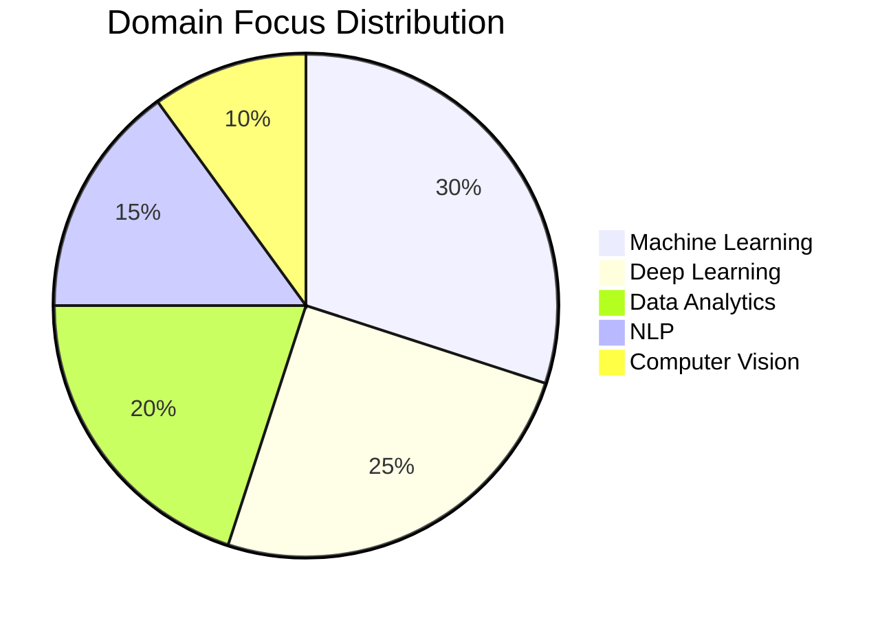

<div align="center">

<!-- ▓▓ GLITCH NAME ▓▓ -->


<!-- ▓▓ TYPING SUBTITLE ▓▓ -->
<a href="https://git.io/typing-svg">
  
</a>

<br/>

<!-- ▓▓ NEON DIVIDER ▓▓ -->


<!-- ▓▓ TECH BADGES ▓▓ -->
<br/>


<br/>


</div>

-----

<div align="center">

### •   A B O U T   M E   •

I am an aspiring **Data Scientist** and **ML Engineer** pursuing my B.Tech in CSE (Data Science) at **Woxsen University**. My focus lies at the intersection of complex algorithms and real-world impact—specializing in **Healthcare AI**, **NLP**, and **Predictive Analytics**. I strive to transform raw data into scalable, life-saving insights through innovative engineering and research.

</div>

-----

<!-- ═══════════════════════════════════════════════════════════ -->

<!--                   •  IDENTITY CORE  •                     -->

<!-- ═══════════════════════════════════════════════════════════ -->

<div align="center">

### •   I D E N T I T Y   C O R E   •

</div>

```
╔══════════════════════════════════════════════════════════════════════╗
║                        GAYATHRI.CORE  v3.0                          ║
╠══════════════════════════════════════════════════════════════════════╣
║                                                                      ║
║  entity        : Gayathri Pocharam                                  ║
║  role          : Data Scientist · ML Engineer · Analyst             ║
║  institute     : Woxsen University — CSE-DS '28                    ║
║  speciality    : Data Science · AI · Machine Learning               ║
║  location      : Hyderabad, India  🇮🇳                               ║
║                                                                      ║
║  domains:                                                            ║
║    ├─ 🤖  Deep Learning & Neural Networks                            ║
║    ├─ 📈  Predictive Modeling & Analytics                           ║
║    ├─ 🧠  Natural Language Processing (NLP)                         ║
║    ├─ 👁️  Computer Vision & Image Processing                       ║
║    ├─ 📊  Data Visualization & BI (PowerBI/Tableau)                 ║
║    └─ 💡  Big Data & Cloud Analytics                                ║
║                                                                      ║
║  current_state:                                                      ║
║    semester    : 5th Semester  (3rd Year)                           ║
║    focus       : StrokeGuard AI + Healthcare Analytics              ║
║    mindset     : Data Driven · Insight Oriented · Scalable AI       ║
║    mission     : Transform data into life-saving insights 🌍         ║
║                                                                      ║
║  achievements:                                                       ║
║    🏆  StrokeGuard AI Innovation Lead                               ║
║    🎓  Academic Excellence in Data Science — 2024                   ║
║    🔧  Data Science Portfolio Project Showcase                      ║
║    🎤  AI Research & Workshop Facilitator                           ║
║                                                                      ║
║  status        : <font color="#00C86F">ONLINE</font>  analyzing patterns                             ║
╚══════════════════════════════════════════════════════════════════════╝
```

-----

<!-- ═══════════════════════════════════════════════════════════ -->

<!--                 •  PATENT ACHIEVEMENT  •                  -->

<!-- ═══════════════════════════════════════════════════════════ -->

<div align="center">

### •   P A T E N T   A C H I E V E M E N T   •


**Title:** *Data Science & Analytics System Design*  
**Design No:** `470097-001`  
**Role:** Co-Inventor  
**Authority:** Intellectual Property India, Government of India  

</div>


-----

<div align="center">

### •   T E C H   S T A C K   D N A   •

```
╔══════════════════════════════════════════════════════════════════════╗
║                       • TECH STACK DNA •                           ║
╠══════════════════════════════════════════════════════════════════════╣
║                                                                      ║
║  LANGUAGES      : Python · R · SQL · Julia · C++                    ║
║  FRAMEWORKS     : TensorFlow · PyTorch · Scikit-learn · Pandas      ║
║                   NumPy · Flask · Streamlit                         ║
║  TOOLS          : Git · GitHub · VSCode · Docker · Linux            ║
║  ANALYTICS      : PowerBI · Tableau · Matlab · Excel                ║
║                                                                      ║
║  STATE          : Optimized · Scalable · Insight-Driven             ║
║                                                                      ║
╚══════════════════════════════════════════════════════════════════════╝
```

</div>

<br/>

<div align="center">

### •   S K I L L   M A T R I X   •

</div>

|Domain          |Technology                 |
|----------------|---------------------------|
|🐍 **Languages** |Python · SQL · R · C++     |
|🤖 **AI / ML**   |TensorFlow · PyTorch · Scikit-learn · NLP |
|🐼 **Data**      |Pandas · NumPy · Airflow    |
|📈 **Analytics** |PowerBI · Tableau · Excel  |
|🎨 **Viz**       |Matplotlib · Seaborn · Plotly|
|🐳 **Deployment**|Docker · Flask · Streamlit |

-----

<!-- ═══════════════════════════════════════════════════════════ -->


<!-- ═══════════════════════════════════════════════════════════ -->


-----

<!-- ═══════════════════════════════════════════════════════════ -->

<!--          •  FEATURED PROJECT DEEP DIVES  •                -->

<!-- ═══════════════════════════════════════════════════════════ -->

<div align="center">

### •   F E A T U R E D   P R O J E C T S   —   D E E P   D I V E   •

</div>

<table>
<tr>
<td width="50%" valign="top">

**🧠 StrokeGuard AI — Health Prediction**
*ML-Powered Early Warning System*

```
┌─────────────────────────────────┐
│         DATA PIPELINE           │
│                                 │
│  [ CLINICAL DATA INPUT ]        │
│        ↓                        │
│  [ Pre-processing Lab ]         │
│    Handling Missing Values      │
│        ↓                        │
│  [ Feature Engineering ]        │
│    Correlating Risk Factors     │
│        ↓                        │
│  [ ML Training Engine ]         │
│    Random Forest / XGBoost      │
│        ↓                        │
│  [ Prediction Web App ]         │
│    Flask / Streamlit Interface  │
└─────────────────────────────────┘
```

**Stack:** `Python` `Scikit-learn` `XGBoost` `Flask` `Pandas`
**Status:** <font color="#00C86F">LIVE</font>

</td>
<td width="50%" valign="top">

**📊 E-commerce BI Dashboard**
*Interactive Business Intelligence Matrix*

```
┌─────────────────────────────────┐
│        ANALYTICS FLOW           │
│                                 │
│  [ RAW SQL DATABASE ]           │
│        ↓                        │
│  [ ETL Processing ]             │
│    Cleaning & Normalizing       │
│        ↓                        │
│  [ PowerBI Core Map ]           │
│    DAX Queries + Visuals        │
│        ↓                        │
│  [ Insight Delivery ]           │
│    Sales + Growth Trends        │
│        ↓                        │
│  [ Periodic Reporting ]         │
│    Automated PDF generation     │
└─────────────────────────────────┘
```

**Stack:** `PowerBI` `SQL` `Python` `Pandas` `Excel`
**Status:** <font color="#00C86F">ACTIVE</font>

</td>
</tr>
</table>

-----

<!-- ═══════════════════════════════════════════════════════════ -->


<!-- ═══════════════════════════════════════════════════════════ -->


<!-- ═══════════════════════════════════════════════════════════ -->


<!-- ═══════════════════════════════════════════════════════════ -->

<!--                 •  GITHUB METRICS  •                      -->

<!-- ═══════════════════════════════════════════════════════════ -->

<div align="center">

### •   G I T H U B   M E T R I C S   •


&nbsp;&nbsp;


<br/><br/>


</div>

-----

<!-- ═══════════════════════════════════════════════════════════ -->

<!--                 •  ACTIVITY GRAPH  •                      -->

<!-- ═══════════════════════════════════════════════════════════ -->

<div align="center">

### •   C O M M I T   T I M E L I N E   •


</div>

-----

<!-- ═══════════════════════════════════════════════════════════ -->

<!--                  •  TROPHIES  •                           -->

<!-- ═══════════════════════════════════════════════════════════ -->

<div align="center">

### •   A C H I E V E M E N T   G R I D   •


<br/>

|🏆 Award                             |📅 Year |🏛️ Institution              |
|------------------------------------|:-----:|---------------------------|
|StrokeGuard AI Innovation Lead      |2024   |Woxsen School of Technology|
|Academic Excellence in Data Science  |2024   |Woxsen University          |
|15+ Data Science Public Projects    |2024–25|GitHub                     |
|AI Research & Workshop Facilitator  |2024–25|Various · Peer-led         |

</div>

-----

<!-- ═══════════════════════════════════════════════════════════ -->

<!--              •  DOMAIN EXPERTISE PIE  •                   -->

<!-- ═══════════════════════════════════════════════════════════ -->

<div align="center">

### •   D O M A I N   F O C U S   D I S T R I B U T I O N   •

</div>



-----

<!-- ═══════════════════════════════════════════════════════════ -->

<!--                  •  AI PERSONALITY  •                     -->

<!-- ═══════════════════════════════════════════════════════════ -->

<div align="center">

### •   G A Y A T H R I . A I   —   P E R S O N A L I T Y   M O D U L E   •

</div>

```python
class GayathriPocharam:
    """
    ╔══════════════════════════════════════════════════════════╗
    ║        GAYATHRI POCHARAM — DATA SCIENTIST OPERATING SYS  ║
    ║        Version: 3.0-stable  |  Build: 2028-optimized     ║
    ╚══════════════════════════════════════════════════════════╝
    """

    OPERATING_SINCE = 2024
    VERSION         = "3.0-stable"
    UNIVERSITY      = "Woxsen University — CSE-DS '28"
    LOCATION        = "Hyderabad, India 🇮🇳"

    def __init__(self):
        self.role         = "Data Scientist · ML Engineer · AI Researcher"
        self.domains      = ["Machine Learning", "Deep Learning", "NLP", "Computer Vision", "BI"]
        self.stack        = ["Python", "R", "SQL", "TensorFlow", "Scikit-learn", "PowerBI"]
        self.specialty    = "Predictive Healthcare & StrokeGuard AI"
        self.mindset      = "Data is the new oil. Insights are the new currency."
        self.fuel         = ["Clean Data 📊", "Hyperparameter Tuning", "Deep Neural Nets", "Latte ☕"]
        self.achievements = [
            "StrokeGuard Innovation Lead",
            "Academic Excellence 2024",
            "15+ DS Projects",
            "AI Workshop Lead"
        ]
        self.status       = "🟢 ONLINE — extracting insights"

    def analyze(self)  -> str: return "What do the patterns tell us about the future?"
    def solve(self)    -> str: return "Optimization is key. Clean. Model. Predict."
    def learn(self)    -> str: return "Every dataset is a new world waiting to be discovered."
    def goal(self)     -> str: return "Build AI that saves lives and scales impact. 🌍"
    def current(self)  -> str: return "Woxsen University CSE → Data Science Track"
    def next(self)     -> str: return "DS Internship → AI Research → Global Innovation"

    def system_check(self) -> dict:
        return {
            "ml_engine"      : "🟢 ONLINE — StrokeGuard + XGBoost loaded",
            "nlp_hub"        : "🟢 ONLINE — BERT + Sentiment Transformers",
            "viz_lab"        : "🟢 ONLINE — PowerBI + Plotly active",
            "data_pipeline"  : "🟢 ONLINE — ETL Scrapers synced",
            "model_ops"      : "🟢 ONLINE — Dockerized + Monitoring",
        }


gayathri = GayathriPocharam()
print(gayathri.goal())          # → "Build AI that saves lives and scales impact. 🌍"
print(gayathri.system_check())  # → All systems nominal
```

-----

<!-- ═══════════════════════════════════════════════════════════ -->


<!-- ═══════════════════════════════════════════════════════════ -->


<!-- ═══════════════════════════════════════════════════════════ -->


<!-- ═══════════════════════════════════════════════════════════ -->

<!--               •  CONNECT / CONTACT  •                     -->

<!-- ═══════════════════════════════════════════════════════════ -->

<div align="center">

### •   E S T A B L I S H   C O N N E C T I O N   •

<a href="https://github.com/GayathriPocharam">
  
</a>
&nbsp;
<a href="https://github.com/GayathriPocharam">
  
</a>
&nbsp;
<a href="https://www.linkedin.com/in/gayathripocharam">
  
</a>

<br/><br/>

|💼 Open To                 |📋 Details                                                        |
|--------------------------|-----------------------------------------------------------------|
|🎯 **Internships**         |Data Science · Machine Learning · AI Research · Analyst Roles    |
|🤝 **Collaborations**      |Open source ML projects · Kaggle · Research papers               |
|🔬 **Research Projects**   |Predictive Healthcare · NLP · Deep Learning Architectures         |
|💡 **Idea Exchange**       |AI product strategy · System design · Big Data optimization      |
|🌍 **Remote Opportunities**|Open to global remote collaborations                             |

<br/>


> *“Every pattern we discover is a step toward saving a life through Data Science.”*

</div>

-----

<!-- ════════════ FOOTER WAVE ════════════ -->

<div align="center">


<br/>

<sub>• Crafted with intent · Powered by curiosity · Secured by design · Deployed with precision •</sub>

</div>
